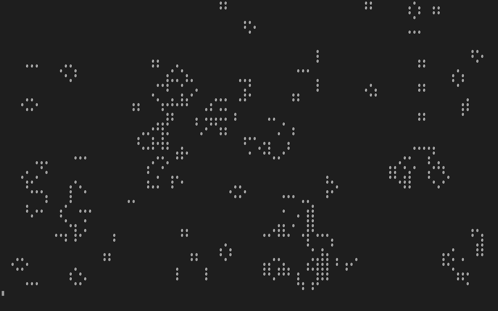

# GameOfLife-terminal
This is a rework of Conway's game of life i did in python that can be executed in any computer's terminal. The code is meant to be minimalistic and was written in one afternoon. By running the main script, a random terrain with generate and the simulation will begin. 
No libraries are needed, this script can run on any platform.

